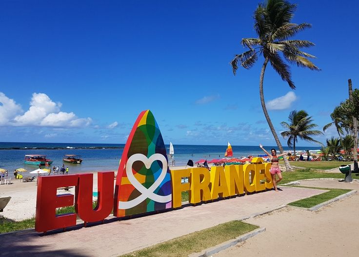

# Marechal Deodoro - Site Informativo

Este projeto é uma página informativa sobre o município de **Marechal Deodoro**, localizado no estado de **Alagoas, Brasil**. O site oferece informações sobre a história da cidade, suas atrações turísticas, como as praias e museus, além de opções de hospedagem.

## Tecnologias Utilizadas

- **HTML**: Para estruturação do conteúdo da página.
- **CSS**: Para estilizar o conteúdo da página, incluindo imagens e textos.
- **Google Fonts**: Utilização das fontes "Alice" e "Lato" para uma tipografia moderna e legível.
- **Imagens**: Imagens representativas de pontos turísticos e hospedagens.

## Estrutura do Projeto

Este repositório contém os seguintes arquivos principais:

- **index.html**: Arquivo principal que contém o conteúdo da página informativa sobre Marechal Deodoro.
- **style.css**: Arquivo CSS que estiliza a página, ajustando layout, cores e fontes.
- **assets**: Pasta contendo imagens usadas no site (praias, museus, hospedagens).

### Layout e Design

- O layout da página é simples e centrado em torno de seções com títulos, imagens e descrições.
- Utiliza o Flexbox para dispor as imagens de forma organizada e centralizada.

## Funcionalidades

- **Página Responsiva**: A página foi criada para ser visualizada adequadamente em diversos dispositivos, desde computadores de mesa até smartphones.
- **Seções Informativas**: O site é dividido em seções como:
  - **Descrição do Município**: Detalhes sobre a história e as atrações turísticas de Marechal Deodoro.
  - **Passeios Disponíveis**: Lista de passeios turísticos e suas descrições.
  - **Hospedagens**: Sugestões de lugares para se hospedar com descrições de serviços e localização.
  - **Imagens**: Imagens das atrações turísticas e hospedagens que tornam o site mais visual e atraente.
  
## Como Executar o Projeto

1. Clone o repositório em sua máquina local:
    ```bash
    git clone https://github.com/seu-usuario/marechal-deodoro.git
    ```

2. Navegue até o diretório do projeto:
    ```bash
    cd desafio
    ```

3. Abra o arquivo `index.html` em seu navegador favorito para visualizar a página.

## Screenshots

### Imagem Principal


*Praia de Marechal Deodoro, uma das atrações principais.*

### Atrações Turísticas


*Praia do Francês, conhecida por suas águas cristalinas.*

### Hospedagens


*Hotel Ponta Verde, localizado na famosa Praia do Francês.*

## Contribuição

Contribuições são bem-vindas! Se você quiser ajudar no projeto, siga as etapas abaixo:

1. Faça um fork do repositório.
2. Crie uma nova branch para suas alterações.
3. Faça um commit das suas alterações.
4. Envie um pull request para o repositório original.
